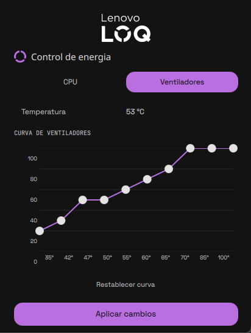

# Legion Power
Modelo: LOQ 15IRX10 (83JE)

BIOS: R3CN44WW

Síntoma: CPU a 400 MHz con temps normales, solo en modo custom, solo en Linux.

Evidencia: powermode EC=144 aunque el driver diga 255; /sys/devices/platform/legion/powermode solo acepta 255 pero el EC lo ignora; curva en hardware corrupta; funciona en Windows con el mismo hardware y adaptadores distintos.

Conclusión: limitación del EC, no del driver ni de la configuración.

Plugin de la barra de Ryoku para portátiles Lenovo Legion / LOQ: controla el límite de potencia (PL1), el techo de frecuencia, el modo de energía y la curva de los ventiladores desde un panel, y guarda tu configuración.

*English: a Ryoku bar plugin for Lenovo Legion/LOQ laptops (PL1, CPU frequency cap, power mode and fan curve). Documentation is in Spanish.*



## Instalación

```bash
git clone https://github.com/aztrixx/legion-power.git legion-power
cd legion-power
./install.sh
```

Después abre **QS Bar Settings > Community** y activa *Legion Power*. Para actualizar una instalación existente: `./install.sh --reinstall`.

Requiere Ryoku, un Legion/LOQ con el driver `legion_laptop` de [LenovoLegionLinux](https://github.com/johnfanv2/LenovoLegionLinux), CPU Intel, `pkexec` y `sensors`.
- Tested only on the LOQ 15IRX10; I do not know—nor do I have a device to verify—whether it works on other models.

## Contenido del repositorio

- `install.sh`: instalador (ajusta la ruta del helper a tu `$HOME`, valida e instala).
- `legion-power/`: el plugin en sí. Su [README](legion-power/README.md) documenta qué hace, qué lee, qué escribe y qué se ejecuta con privilegios.


## Licencia

MIT.
