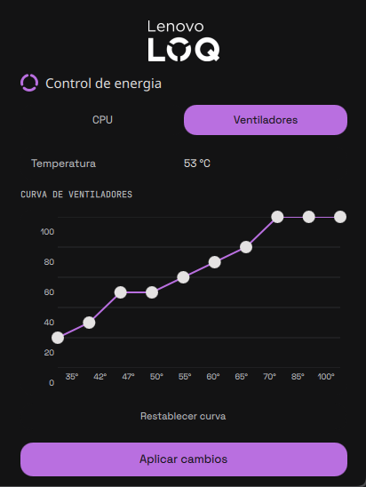

# Legion Power

Plugin de la barra de Ryoku (`legion-power`) para portátiles Lenovo Legion / LOQ. Desde un panel de la barra controla el límite de potencia (PL1), el techo de frecuencia de la CPU, el modo de energía y la curva de los ventiladores, guarda tu configuración y la vuelve a aplicar al entrar en el modo `custom`.

*English: a Ryoku bar plugin for Lenovo Legion/LOQ laptops. It sets PL1, the CPU frequency cap, the power mode and the fan curve from a bar panel, persists your settings and re-applies them when the `custom` mode is entered. Documentation is in Spanish.*



## Requisitos

- Ryoku (probado en `0.63.1-beta.19`) con el comando `ryoku`.
- Un portátil Lenovo Legion o LOQ con el driver `legion_laptop` de [LenovoLegionLinux](https://github.com/johnfanv2/LenovoLegionLinux) cargado (debe existir un hwmon llamado `legion_hwmon`).
- CPU Intel (usa `intel-rapl` e `intel_pstate`).
- `pkexec` (polkit) y `sensors` (lm_sensors).

Probado en un Lenovo LOQ 15 (i5-13450HX, RTX 5050). En otro modelo los umbrales de la curva y el techo de RPM pueden ser distintos (ver [Ventiladores](#ventiladores)).

## Instalación

La forma recomendada es el instalador, que está en la raíz del repositorio (fuera de esta carpeta):

```bash
git clone <url-de-este-repositorio> legion-power
cd legion-power
./install.sh
```

Después abre **QS Bar Settings > Community** y activa *Legion Power*.

Ryoku exige que la ruta absoluta del helper sea idéntica en `manifest.json` (`capabilities.privileged`) y en `service/Main.qml`, y esas rutas traen el `$HOME` del autor (`/home/astrixx`). El instalador copia el plugin a una carpeta temporal, sustituye esa ruta por tu `$HOME`, lo valida con `ryoku plugin validate` y lo instala con `ryoku plugin add --bar --yes`, sin modificar el repositorio. Para actualizar una instalación existente usa `./install.sh --reinstall`.

Instalación manual: cambia `/home/astrixx/.local/share` por `$HOME/.local/share` en esos dos archivos y ejecuta `ryoku plugin add . --bar --yes` dentro de esta carpeta.

Para quitarlo: `ryoku plugin remove legion-power`.

## Qué hace

Pestañas **CPU** y **Ventiladores**:

- **PL1**: límite de potencia sostenida, de 25 a 95 W.
- **Techo de frecuencia**: de 40 a 100 % (`max_perf_pct`).
- **Modo de energía**: `low-power`, `balanced`, `performance`, `max-power` o `custom`. El plugin también sigue el modo real, por ejemplo cuando lo cambias con Fn+Q.
- **Curva de ventiladores**: diez puntos con umbrales de temperatura fijos (35 a 100 °C); solo se edita el porcentaje de cada punto, de 10 en 10.

Con **Aplicar cambios** se guarda el estado y se aplica al hardware. Además, al pasar de otro modo a `custom` el plugin vuelve a aplicar tu configuración guardada sin que tengas que pulsar nada (puede pedirte la contraseña de polkit).

### Ventiladores

El driver `legion_laptop` escala la curva con un máximo genérico de 10000 RPM (`fan1_max`) que estos ventiladores no alcanzan. Los porcentajes de la gráfica se calculan contra un techo real de **4400 RPM** (`FAN_REAL_MAX_RPM` en `bin/legion-power-helper.sh`), así que 100 % es el máximo real del ventilador. Con la escala del driver, todo punto por encima de ~44 % pedía más de lo que el ventilador puede dar. En el equipo de pruebas el ventilador 2 llega a unos 4500 RPM y el driver lo reporta ligeramente por encima del ventilador 1; no es un error.

Si tu portátil llega a otro valor, mide `fan1_input` con el modo de velocidad máxima activo y cambia `FAN_REAL_MAX_RPM`. Bajar los puntos de la curva reduce el ruido pero también la refrigeración: úsalo bajo tu responsabilidad y vigila las temperaturas.

## Qué ejecuta, qué lee y qué escribe

**Sin privilegios** (`service/Main.qml`, `bin/save-state.sh`):

- Lee `/sys/devices/system/cpu/cpu0/cpufreq/scaling_cur_freq`, `/sys/class/platform-profile/platform-profile-0/profile` y la temperatura con `sensors`.
- Escribe únicamente su archivo de estado en `pluginApi.stateDir` (por defecto `~/.local/state/ryoku/plugins/legion-power/state`) con los valores `watts`, `freqpct`, `mode` y `fanpwm`.

**Con privilegios**: un único comando fijo, ejecutado con `pkexec` al pulsar **Aplicar cambios** o al entrar en `custom` (ver arriba):

```
pkexec <home>/.local/share/ryoku/plugins/legion-power/bin/legion-power-helper.sh apply
```

Ese comando figura en `capabilities.privileged` del manifest. El helper corre como root, lee el archivo de estado del usuario y, tras validar cada valor (enteros en rango, modo dentro de una lista cerrada), escribe solo en:

- `/sys/class/powercap/intel-rapl:0/constraint_0_power_limit_uw` (PL1)
- `/sys/devices/system/cpu/intel_pstate/max_perf_pct` (techo de frecuencia)
- `/sys/class/platform-profile/platform-profile-0/profile` (modo de energía)
- `<hwmon de legion_hwmon>/pwm{1,2}_auto_point{1..10}_{pwm,temp,temp_hyst}` (curva de ventiladores)

**Red**: ninguna. El plugin no declara ni usa `capabilities.network`.

**Limitación conocida**: el helper asume que `pluginApi.stateDir` es el valor por defecto (`~/.local/state/...`). Si defines otro `XDG_STATE_HOME`, edita `STATE_FILE` en `bin/legion-power-helper.sh`.

## Estructura

```
manifest.json                metadatos y capacidades
service/Main.qml             lógica y estado, sin UI
content/                     Widget (glifo de la barra), Panel y componentes
bin/legion-power-helper.sh   helper privilegiado (pkexec)
bin/save-state.sh            guarda el estado sin privilegios
```

## Licencia

MIT. Plugin de la comunidad (`official` es `false`), hecho por astrixx.
